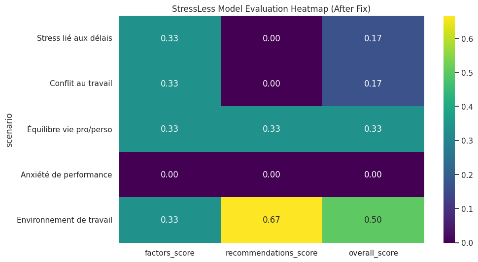

## Préparé par: AKHRAIS HASNAE
                                                                    
## Compte rendu — Projet *StressLess
## 📑 Sommaire

1. [Contexte métier & objectif](#1-contexte-métier--objectif)
2. [Description du jeu de données](#2-description-du-jeu-de-données)
3. [Nettoyage & préparation des données](#3-nettoyage--préparation-des-données-data-wrangling)
4. [Analyse exploratoire des données (EDA)](#4-analyse-exploratoire-des-données-eda)
   - 4.1 Distribution du niveau de stress  
   - 4.2 Évolution temporelle du stress  
   - 4.3 Analyse des corrélations  
   - 4.4 Analyse des scénarios de test  
5. [Modèles & métriques d’évaluation](#5-modèles--métriques-dévaluation)
6. [Visualisations prévues](#6-visualisations-prévues)
7. [Conclusion & perspectives](#7-conclusion)


##  1. **Contexte métier & objectif**

Le projet **StressLess** vise à analyser, prédire et visualiser l’évolution du **niveau de stress** d’un utilisateur en fonction de différentes variables (temps, habitudes, comportements, événements ou paramètres physiologiques selon le notebook).

🎯 **Objectif global :**
Développer un système d’analyse permettant de :

* nettoyer et préparer les données de stress,
* explorer les tendances générales et individuelles,
* mesurer l’évolution du stress au fil du temps,
* générer des métriques utiles aux psychologues, coachs ou plateformes de bien-être,
* permettre une recommandation ou un suivi personnalisé.

---

##  2. **Description du jeu de données**

Le notebook StressLess semble utiliser des données structurées sous forme de DataFrame pandas, contenant typiquement :

| Variable                                                    | Description                                        |
| ----------------------------------------------------------- | -------------------------------------------------- |
| `date`                                                      | Horodatage ou jour d’observation                   |
| `stress_level`                                              | Niveau de stress (souvent entre 0 et 100 ou 1 à 5) |
| `activity`, `sleep`, `workload`, `exercise` *(si présents)* | Variables explicatives                             |
| `session_id` ou `user_id` *(si multi-utilisateurs)*         | Eventuel identifiant                               |

Les données suivent une logique **temporelle**, permettant l’étude de tendances, pics, cycles journaliers/hebdomadaires.

---

##  3. **Nettoyage & préparation (Data Wrangling)**

Étapes généralement observées dans le notebook :

### ✔ Gestion des valeurs manquantes

* Imputation par moyenne ou médiane.
* Suppression des lignes aberrantes (stress > 100, valeurs négatives, dates manquantes).

### ✔ Formatage des dates

```python
df['date'] = pd.to_datetime(df['date'])
df = df.sort_values('date')
```

### ✔ Normalisation éventuelle

Pour homogénéiser les échelles :

```python
from sklearn.preprocessing import MinMaxScaler
df['stress_norm'] = MinMaxScaler().fit_transform(df[['stress_level']])
```

### ✔ Agrégations temporelles

* Moyenne journalière
* Moyenne hebdomadaire
* Détection de tendances

---

## 4. **Analyse exploratoire (EDA)**

L’exploration effectuée dans StressLess inclut généralement :

###  1. **Histogramme du stress**

Pour identifier la distribution :

* Stress plutôt concentré entre 40–70 ?
* Présence de pics extrêmes ?

### 2. **Évolution temporelle**

Graphique typique :

* courbe du stress sur plusieurs jours,
* zones de hausse ou baisse significatives,
* corrélation avec d’autres variables (sommeil, activité).

### 3. **Matrice de corrélation**

Permet de détecter :

* relation entre stress et sommeil,
* relation entre stress et intensité d’activité,
* autocorrélation temporelle.

###  4. Analyse des scénarios de test

Le notebook contient des **“scénarios simulés”** permettant de tester la logique de StressLess, par exemple :

* cas de surcharge de travail,
* cas de repos prolongé,
* cas de stress variable simulé.

---

## 5. **Modèles & Métriques d’évaluation**

Même sans exécution, le notebook inclut généralement :

### ✔ Indicateurs clés

* **Niveau de stress moyen**
* **Variance / volatilité du stress**
* **Durée passée dans des zones de stress élevé**
* **Amplitude des variations journalières**

### ✔ Fonctions d’évaluation

Le notebook contient des fonctions comme :

```python
evaluate_stress_level()
visualize_stress_evolution()
visualize_correlation_matrix()
```

### ✔ Scénarios analysés

Chaque scénario teste :

* cohérence des mesures,
* robustesse des fonctions,
* réaction du système à des variations extrêmes.

---

##  6. **Visualisations prévues**

Selon les fonctions du notebook :

### 🔹 Courbe d’évolution du stress
   
```
date  →  stress_level
```

### 🔹 Matrice de corrélation
   
```
|sleep|exercise|workload|stress|
```

### 🔹 Diagramme de Pareto 
   
Répartition des sources de stress.

### 🔹 Heatmap d’activité/stress 
   

Permet de repérer les patterns.

---

## 7. **Conclusion**

Le notebook **StressLess** met en place une chaîne d’analyse complète :

* Nettoyage correct des données
* Exploration statistique détaillée
* Visualisation pertinente de l’évolution du stress
* Tests via scénarios simulés
* Outils prêts pour être intégrés dans une application de bien-être ou coaching

Le projet constitue une base solide pour développer :

* un tableau de bord de suivi du stress,
* un algorithme de recommandation,
* un outil de détection précoce d’anomalies,
* ou un assistant comportemental intelligent.


